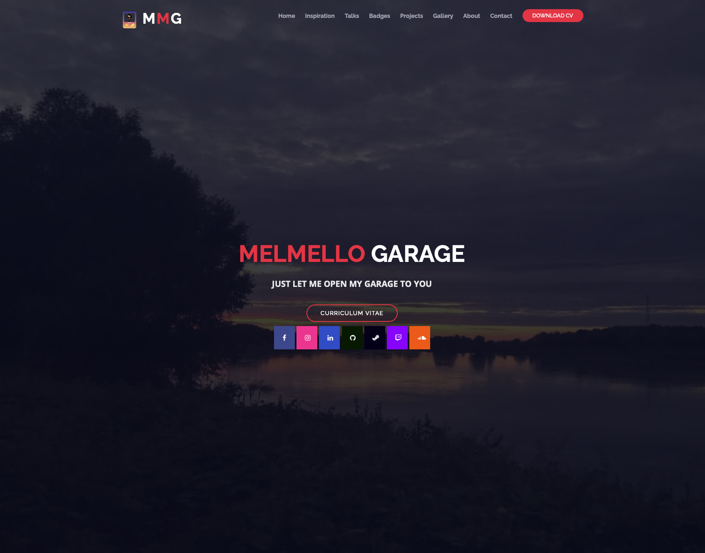

### Hi there 👋

# ✨ Simply me

"Il computer non è una macchina intelligente che aiuta le persone stupide, anzi è una macchina stupida che funziona solo nelle mani delle persone intelligenti".
This quote by Umberto Eco has always led me to think that computer science should spread throughout our country so to be defined as useful rather than difficult. This is precisely the dream that I, Giulio Melloni, a '94 boy, want to pursue. At the age of 6, I took my first steps on a computer with little more than 128MB of Ram and a HDD not comparable to the one placed on a modern smartphone. Gradually, as I grew up, I got deeper and deeper into the subject, until I studied it in depth by attending the Computer Science & Engineering Faculty with a specialisation in Artificial Intelligence. Working in roles related to the world of Big Data on Azure Cloud, my strong propensity for the world of Software Engineering and my horizontality in the field played a key role in the creation of Big Data architectures that strongly follow DevOps, Agile and software development principles and best practices.

# 🤷🏼‍♂️ About me

👨🏼‍💻 Azure Data Architect @ NTT DATA Italia S.p.A.

👨🏻‍🏫 Tutor @ Boolean S.r.l.

🔝 Top Talent Member @ Nova Talent S.r.l.

🤩 Conference and Meetup speaker

💻 Azure, Python, Databricks, Big Data, AI, DevOps, Agile, Software Engineering

🌱 Nature and mountain lover

🏂 Passionate snowboarder

🥁 Drummer

💬 Ask me anything on Data and AI, or give me some tips on these!

# 🧬 My Life

## 🖥️ Weekdays

## 🏖️ Holidays

# 📅 In Presence Conferences and Meetups

| Day        | Name                              | Organizer   | How      |
| ---------- | --------------------------------- | ----------- | -------- |
| 2024-05-30 | PyCon Italia                      | PyCon       | Speaker  |
| 2024-05-29 | PyCon Italia                      | PyCon       | Speaker  |
| 2024-05-07 | Databricks Day                    | NTT DATA    | Attendee |
| 2024-04-11 | Data Intelligence Day (Barcelona) | Databricks  | Attendee |
| 2024-11-26 | DATA + AI World Tour              | Databricks  | Attendee |
| 2024-11-23 | Data Saturday                     | Engage Labs | Attendee |
| 2024-04-09 | Data Intelligence Day             | Databricks  | Attendee |
| 2024-02-06 | Databricks Partner Champions      | Databricks  | Attendee |
| 2023-11-30 | DATA + AI World Tour              | Databricks  | Attendee |
| 2023-11-18 | Data Saturday Parma               | Engage Labs | Attendee |
| 2023-11-09 | KLab 2023 #2 - Azure OpenAI       | KLab        | Attendee |
| 2023-10-21 | DevOps Heroes                     | Engage Labs | Speaker  |
| 2023-10-14 | Azure Day                         | DotNetCode  | Attendee |
| 2023-09-05 | Microsoft Build Italy             | Microsoft   | Attendee |
| 2023-06-05 | Italy North Region Launch         | Microsoft   | Attendee |
| 2023-04-11 | Data Week Plus                    | Boolean     | Attendee |
| 2023-03-30 | Lakehouse Day                     | Databricks  | Attendee |
| 2023-03-23 | Demystifying Data Mesh            | UGIdotNET   | Attendee |
| 2023-03-22 | Big Data Masterclass              | Boolean     | Speaker  |
| 2022-11-26 | Data Saturday                     | Engage Labs | Attendee |
| 2022-10-22 | DevOps Heroes                     | Engage Labs | Attendee |
| 2022-10-12 | Microsoft Ignite                  | Microsoft   | Attendee |
| 2022-06-24 | Azure Day                         | DotNetCode  | Attendee |
| 2022-05-04 | Databricks Italy Launch Event     | Databricks  | Attendee |
| 2016-11-26 | Codemotion                        | Codemotion  | Attendee |

# ✨ GitHub stats ✨

